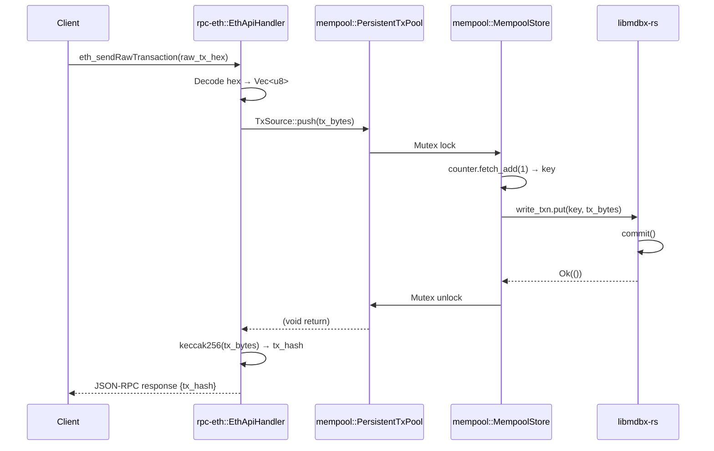
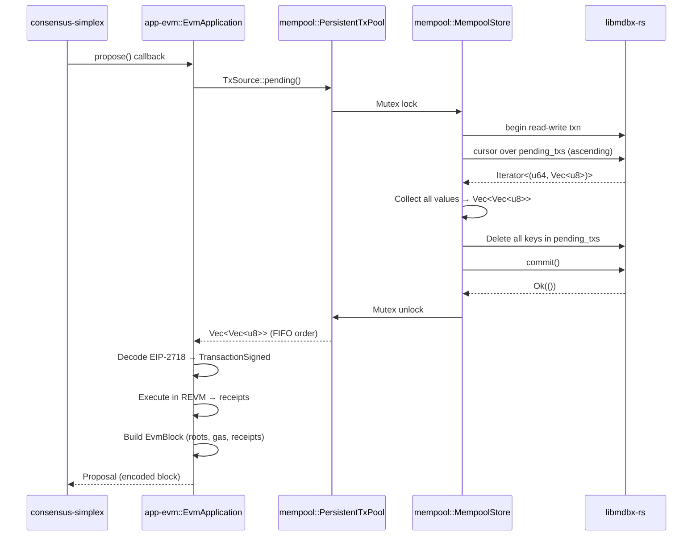
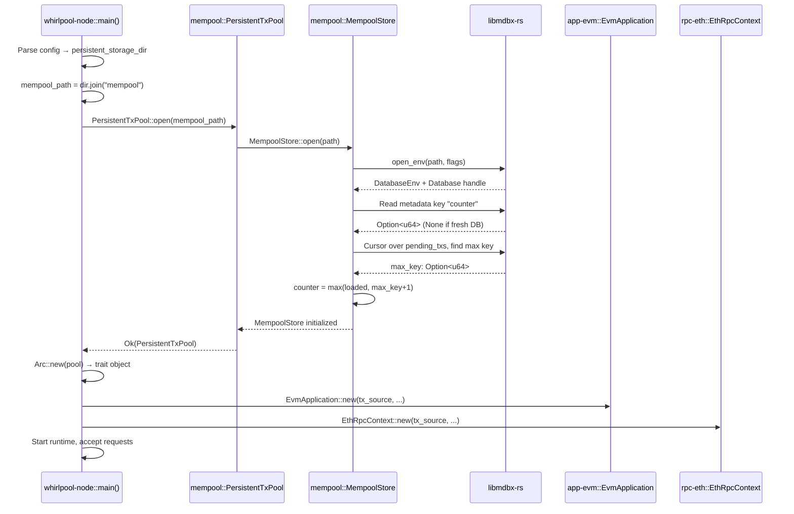
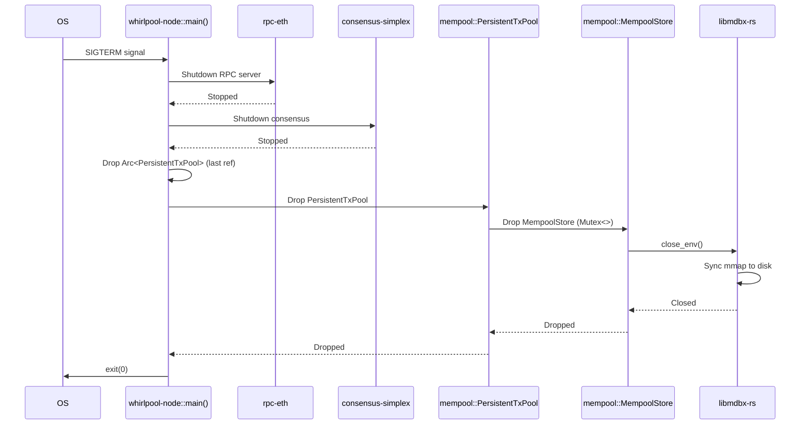
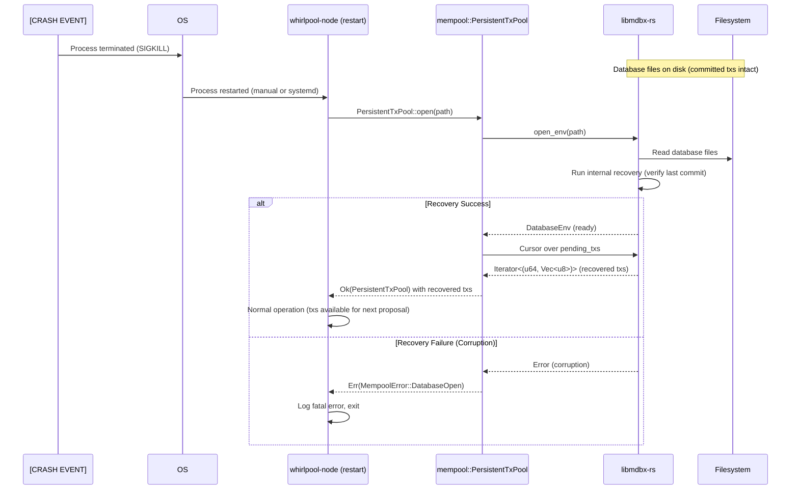

# Flows

## Flow Index

| Flow | Trigger | Summary | Crates Touched | Status |
|------|---------|---------|----------------|--------|
| Transaction Submission | RPC `eth_sendRawTransaction` | Client submits raw tx → RPC handler pushes to persistent pool → MDBX write → return tx hash | `rpc-eth`, `mempool` | [PROPOSED] |
| Transaction Drain | `EvmApplication.propose()` | Consensus requests txs → read all from MDBX (FIFO) → delete from MDBX → return Vec → execute | `app-evm`, `mempool` | [PROPOSED] |
| Node Startup/Recovery | Node process start | Open MDBX at path → load max key counter → existing unproposed txs available immediately | `whirlpool-node`, `mempool` | [PROPOSED] |
| Node Shutdown | Node process termination | MDBX handles durability automatically → no explicit flush needed → clean exit | `whirlpool-node`, `mempool` | [PROPOSED] |
| Crash Recovery | Node crash/SIGKILL | MDBX ACID guarantees persist committed txs → un-proposed txs survive → proposed-but-not-finalized lost (accepted) | `mempool` (recovery semantics) | [PROPOSED] |

---

## Flow Contracts

### Transaction Submission Flow

**[PROPOSED]** — New persistence behavior for existing RPC submission path.

#### Trigger
External Ethereum client calls `eth_sendRawTransaction` JSON-RPC method with raw EIP-2718 encoded transaction bytes.

#### Steps

| Step | Owner Crate | Input Contract | Output Contract | Error Surface | Status |
|------|-------------|----------------|-----------------|---------------|--------|
| 1. RPC Decode | `rpc-eth` | JSON-RPC request with hex-encoded tx bytes | Validated request, decoded `Vec<u8>` | Invalid hex, malformed JSON → JSON-RPC error response | [GROUNDED: `rpc-eth/src/eth_handler.rs`] |
| 2. Trait Object Call | `rpc-eth` | Decoded `Vec<u8>` tx bytes | Invocation of `TxSource::push(tx)` on trait object | None (infallible trait contract) | [PROPOSED: trait boundary] |
| 3. Acquire Lock | `mempool` | `push(tx)` call on `PersistentTxPool` | Mutex acquired on `MempoolStore` | Contention (blocks briefly) | [PROPOSED: `mempool/src/persistent.rs`] |
| 4. Fetch Counter | `mempool` | Current auto-increment counter | Next key: `u64` | None (atomic fetch_add) | [PROPOSED: `mempool/src/store.rs`] |
| 5. MDBX Write Txn | `mempool` | Key-value pair: `(u64, Vec<u8>)` | MDBX transaction commit | Disk full, permissions, corruption → logged, tx dropped | [PROPOSED: `mempool/src/store.rs`] |
| 6. Release Lock | `mempool` | Write complete or failed | Mutex released | None | [PROPOSED] |
| 7. Return Hash | `rpc-eth` | Push completed | Compute keccak256(tx), return JSON-RPC response with tx hash | None | [GROUNDED: `rpc-eth/src/eth_handler.rs`] |

#### Handoff Contracts

**RPC → Mempool** (`rpc-eth` → `mempool`)
- **Interface**: `TxSource::push(tx: Vec<u8>)`
- **Pre-condition**: `tx` is non-empty raw bytes (EIP-2718 or legacy RLP)
- **Post-condition**: Transaction persisted to MDBX OR silently dropped on error (infallible trait)
- **Invariant**: No validation of transaction structure (deferred to execution layer)

**Evidence**: [GROUNDED] `rpc-eth/src/context.rs` currently calls `tx_pool.push()`. [PROPOSED] After generification, calls `TxSource::push()` on trait object.

#### Error Paths

1. **MDBX Write Failure** (Step 5)
   - **Cause**: Disk full, I/O error, database corruption
   - **Handling**: Log error with context (`tracing::error!`), drop transaction, return success to RPC (preserve infallible contract)
   - **Impact**: Transaction lost, client sees success but tx never executed (same as network loss scenario)
   - **Future Mitigation**: Return error code to RPC layer for honest client feedback (requires trait signature change)

2. **Lock Contention** (Step 3)
   - **Cause**: Concurrent `push()` calls or long-running `drain_pending()` operation
   - **Handling**: Block until lock acquired (Mutex semantics)
   - **Impact**: Increased p99 latency for `eth_sendRawTransaction` RPC calls
   - **Mitigation**: MDBX writes are fast (<1ms expected) → contention unlikely in practice

#### Sequence Diagram



#### Open Questions / TODOs
- `UNKNOWN`: Actual MDBX write latency on production hardware — expect <1ms but unmeasured
- [PROPOSED — Future]: Add `Result` return to `TxSource::push()` for honest error propagation to RPC clients (breaking trait change)

---

### Transaction Drain Flow

**[PROPOSED]** — Persistence-aware drain semantics matching `InMemoryTxPool` FIFO behavior.

#### Trigger
`EvmApplication.propose()` called by consensus layer to build new block proposal.

#### Steps

| Step | Owner Crate | Input Contract | Output Contract | Error Surface | Status |
|------|-------------|----------------|-----------------|---------------|--------|
| 1. Consensus Callback | `app-evm` | Consensus requests proposal | `EvmApplication.propose()` invoked | None (consensus-driven) | [GROUNDED: `app-evm/src/executor.rs:155`] |
| 2. Trait Object Call | `app-evm` | Call `self.tx_source.pending()` on trait object | Invocation of `TxSource::pending()` | None (infallible trait) | [GROUNDED: `app-evm/src/executor.rs:48`] |
| 3. Acquire Lock | `mempool` | `pending()` call on `PersistentTxPool` | Mutex acquired on `MempoolStore` | Contention (blocks briefly) | [PROPOSED: `mempool/src/persistent.rs`] |
| 4. MDBX Read Txn | `mempool` | Begin read-write transaction | Cursor over `pending_txs` table | Database error → logged, return empty vec | [PROPOSED: `mempool/src/store.rs`] |
| 5. Scan All Keys | `mempool` | Iterate cursor in ascending key order | Collect all `Vec<u8>` values into Vec | Database error mid-scan → partial results | [PROPOSED: `mempool/src/store.rs`] |
| 6. Delete All Keys | `mempool` | Same transaction, cursor over keys | Delete all entries in `pending_txs` | Database error → abort, return empty vec | [PROPOSED: `mempool/src/store.rs`] |
| 7. MDBX Commit | `mempool` | Commit read-write transaction | Atomic drain (read + delete) | Commit failure → rollback, return empty vec | [PROPOSED: `mempool/src/store.rs`] |
| 8. Release Lock | `mempool` | Transaction complete | Mutex released, DB empty | None | [PROPOSED] |
| 9. Return Vec | `mempool` | Drained txs `Vec<Vec<u8>>` | Returned to `EvmApplication` | None | [PROPOSED] |
| 10. Decode EIP-2718 | `app-evm` | Raw tx bytes | `TransactionSigned` structs | Invalid encoding → skip tx, log error | [GROUNDED: `app-evm/src/executor.rs`] |
| 11. Execute in REVM | `app-evm` | Decoded transactions | State changes, receipts, gas used | EVM revert → include failed tx in block | [GROUNDED: `app-evm/src/executor.rs`] |
| 12. Build Block | `app-evm` | Execution results | `EvmBlock` with roots, receipts | None (block always buildable) | [GROUNDED: `app-evm/src/executor.rs`] |

#### Handoff Contracts

**Execution → Mempool** (`app-evm` → `mempool`)
- **Interface**: `TxSource::pending() -> Vec<Vec<u8>>`
- **Pre-condition**: None (can be called at any time, even if pool empty)
- **Post-condition**: All transactions drained from pool, pool empty after call
- **Invariant**: FIFO ordering preserved (ascending u64 key order → insertion order)

**Evidence**: [GROUNDED] `app-evm/src/executor.rs:155` calls `self.tx_source.pending()`. [GROUNDED] `app/src/tx_source.rs:36` shows `InMemoryTxPool::pending()` drains via `std::mem::take`.

**Mempool → Execution** (`mempool` → `app-evm`)
- **Interface**: `Vec<Vec<u8>>` returned
- **Pre-condition**: Bytes are raw EIP-2718 or legacy RLP (no validation in mempool)
- **Post-condition**: Execution decodes and validates, skips invalid txs
- **Invariant**: No duplicates within single drain (insertion order may have duplicates across drains)

**Evidence**: [GROUNDED] `app-evm/src/executor.rs` decodes via `TransactionSigned::decode_2718`.

#### Error Paths

1. **MDBX Read Failure** (Step 4)
   - **Cause**: Database corruption, I/O error
   - **Handling**: Log error, return empty `Vec<Vec<u8>>` to preserve infallible contract
   - **Impact**: Block proposed with zero transactions (empty block), pending txs stuck in DB until next drain attempt
   - **Recovery**: Next `pending()` call retries read → transient failures recoverable

2. **MDBX Delete Failure** (Step 6)
   - **Cause**: Database corruption, transaction conflict (unlikely with Mutex)
   - **Handling**: Abort transaction (rollback), log error, return empty vec
   - **Impact**: Transactions remain in DB, included in next proposal (duplicate execution possible)
   - **Mitigation**: MDBX write transactions are single-writer → conflicts rare

3. **MDBX Commit Failure** (Step 7)
   - **Cause**: Disk full, I/O error during commit
   - **Handling**: Transaction rolled back automatically (MDBX semantics), log error, return empty vec
   - **Impact**: Same as delete failure — txs remain in DB for retry

4. **Invalid EIP-2718 Encoding** (Step 10)
   - **Cause**: Corrupted tx bytes in DB, or client submitted malformed data
   - **Handling**: [GROUNDED] `app-evm` skips tx, logs error, continues with remaining txs
   - **Impact**: Invalid tx excluded from block, valid txs processed normally

#### Sequence Diagram



#### Comparison: Before vs. After

**BEFORE (InMemoryTxPool)** [GROUNDED]
```rust
// app/src/tx_source.rs:36
fn pending(&self) -> Vec<Vec<u8>> {
    let mut inner = self.inner.lock();
    std::mem::take(&mut *inner)  // Drain in-memory Vec, FIFO
}
```

**AFTER (PersistentTxPool)** [PROPOSED]
```rust
// mempool/src/persistent.rs (proposed)
fn pending(&self) -> Vec<Vec<u8>> {
    let store = self.store.lock();
    store.drain_pending()  // MDBX: read all (ascending key) + delete all + commit
}
```

**Key Difference**: Drain happens in MDBX write transaction instead of `std::mem::take` on Vec. FIFO semantics preserved via ascending u64 key scan.

#### Open Questions / TODOs
- `UNKNOWN`: Performance of MDBX cursor scan + bulk delete for large mempool (100+ txs) — expect <10ms but unmeasured
- [PROPOSED — Future]: Add `proposed_txs` table to track lifecycle, enable re-queue on crash between propose and finalize

---

### Node Startup/Recovery Flow

**[PROPOSED]** — Crash-recoverable mempool initialization.

#### Trigger
Node process starts via `whirlpool-node` binary main function.

#### Steps

| Step | Owner Crate | Input Contract | Output Contract | Error Surface | Status |
|------|-------------|----------------|-----------------|---------------|--------|
| 1. Parse Config | `whirlpool-node` | Command-line args, config file | `persistent_storage_dir: PathBuf` | Invalid path → fatal error, exit | [GROUNDED: `whirlpool-node/src/main.rs`] |
| 2. Compute Path | `whirlpool-node` | `persistent_storage_dir` | `mempool_path = persistent_storage_dir.join("mempool")` | None (path computation infallible) | [PROPOSED] |
| 3. Open MDBX | `mempool` | `PersistentTxPool::open(mempool_path)` | MDBX `DatabaseEnv` + `Database` handle | Path doesn't exist → create, permissions error → fatal, corruption → fatal | [PROPOSED: `mempool/src/store.rs`] |
| 4. Load Counter | `mempool` | Read metadata key `"counter"` from DB | `u64` next available key, or `0` if fresh DB | None (default to 0 on missing key) | [PROPOSED: `mempool/src/store.rs`] |
| 5. Scan Max Key | `mempool` | Cursor over `pending_txs` table | Find max existing key in DB | Empty DB → max = 0 | [PROPOSED: `mempool/src/store.rs`] |
| 6. Resume Counter | `mempool` | `counter = max(loaded_counter, max_key + 1)` | Counter set to avoid key collisions | None (arithmetic infallible) | [PROPOSED: `mempool/src/store.rs`] |
| 7. Wrap in Arc | `whirlpool-node` | `PersistentTxPool` instance | `Arc<dyn TxSource + Send + Sync>` | None (Arc allocation infallible) | [PROPOSED: `whirlpool-node/src/main.rs`] |
| 8. Inject Dependencies | `whirlpool-node` | Trait object `Arc<dyn TxSource>` | Passed to `EvmApplication::new()` and `EthRpcContext::new()` | None (constructor infallible) | [PROPOSED: `whirlpool-node/src/main.rs`] |
| 9. Start Runtime | `whirlpool-node` | All components wired | Node running, ready to accept RPC and consensus calls | None (runtime startup separate concern) | [GROUNDED: `whirlpool-node/src/main.rs`] |

#### Handoff Contracts

**Node → Mempool** (`whirlpool-node` → `mempool`)
- **Interface**: `PersistentTxPool::open(path: PathBuf) -> Result<Self, MempoolError>`
- **Pre-condition**: `path` is writable directory, or parent exists for directory creation
- **Post-condition**: MDBX database open and ready, existing txs recovered, counter resumed
- **Invariant**: Idempotent — multiple opens of same path return same logical pool (MDBX handles locking)

**Evidence**: [PROPOSED] Based on `state-reth/src/db.rs` pattern for MDBX initialization.

**Mempool → App Components** (`mempool` → `app-evm`, `rpc-eth`)
- **Interface**: `Arc<dyn TxSource + Send + Sync>` trait object
- **Pre-condition**: Mempool open and initialized
- **Post-condition**: Components can call `push()` and `pending()` immediately
- **Invariant**: Recovered txs available via next `pending()` call

**Evidence**: [GROUNDED] `app-evm/src/executor.rs:48` already accepts trait object. [PROPOSED] `rpc-eth/src/context.rs` generified to match.

#### Error Paths

1. **Path Does Not Exist, Parent Not Writable** (Step 3)
   - **Cause**: Invalid `persistent_storage_dir` config, missing mount point
   - **Handling**: `MempoolError::DatabaseOpen` propagated to main, logged with diagnostic, process exits
   - **Impact**: Node fails to start (fatal error)
   - **Mitigation**: Validate paths in config parsing, create parent dirs if needed

2. **Permission Denied** (Step 3)
   - **Cause**: Insufficient filesystem permissions for `mempool/` directory
   - **Handling**: Same as above — fatal error, exit with diagnostic
   - **Impact**: Node fails to start
   - **Mitigation**: Document required permissions, use appropriate user/group for node process

3. **Database Corruption** (Step 3)
   - **Cause**: Partial write during previous crash, hardware failure
   - **Handling**: MDBX `open()` returns error → propagated as fatal, logged with instructions to recover from backup or delete DB
   - **Impact**: Node fails to start, requires manual intervention
   - **Mitigation**: MDBX ACID guarantees minimize corruption risk; future: add auto-repair or backup restore

4. **Counter Desync** (Step 6)
   - **Cause**: Bug in counter persistence logic
   - **Handling**: Use `max(loaded_counter, max_key + 1)` to always resume above highest existing key
   - **Impact**: Gaps in key sequence (harmless), or reused keys (caught by max check)
   - **Mitigation**: Defensive programming — always scan for max key on startup

#### Sequence Diagram



#### Recovery Semantics

**Scenario 1: Clean Shutdown** [PROPOSED]
- Node shuts down gracefully → MDBX flushes to disk (mmap guarantees)
- On restart: all committed txs recovered, counter resumed, normal operation

**Scenario 2: Crash Before Any Transactions** [PROPOSED]
- Fresh node crashes before receiving any txs
- On restart: empty DB, counter = 0, normal operation

**Scenario 3: Crash After Transaction Submission** [PROPOSED]
- Client submits tx → `push()` commits to MDBX → node crashes before `pending()` called
- On restart: tx recovered from DB, included in next proposal
- **Evidence**: MDBX ACID guarantees committed transactions survive crash

**Scenario 4: Crash During `pending()` Drain** [PROPOSED]
- `drain_pending()` reads txs but crashes before MDBX commit
- On restart: read transaction rolled back (MDBX semantics), txs still in DB, recovered normally
- **Evidence**: MDBX write transactions are atomic — partial writes never visible

**Scenario 5: Crash After `pending()` Drain, Before Finalization** [PROPOSED]
- `pending()` drains txs from DB (delete committed) → consensus proposes block → crash before finalization
- On restart: txs are LOST (deleted from DB, not in finalized block)
- **Status**: **ACCEPTED RISK** — same as `InMemoryTxPool` behavior [GROUNDED: `app/src/tx_source.rs:36`]
- **Future Mitigation**: Add `proposed_txs` table, move txs instead of delete, re-queue on crash

#### Open Questions / TODOs
- `UNKNOWN`: MDBX `open()` latency on cold start (mmap setup) — expect <100ms but unmeasured
- [PROPOSED — Future]: Add schema versioning (metadata key `"schema_version"`) for forward compatibility

---

### Node Shutdown Flow

**[PROPOSED]** — Graceful shutdown with MDBX durability guarantees.

#### Trigger
Node process receives `SIGTERM`, `SIGINT`, or graceful shutdown signal.

#### Steps

| Step | Owner Crate | Input Contract | Output Contract | Error Surface | Status |
|------|-------------|----------------|-----------------|---------------|--------|
| 1. Signal Handler | `whirlpool-node` | OS signal (SIGTERM/SIGINT) | Shutdown initiated | None (signal handling infallible) | [GROUNDED: commonware runtime handles signals] |
| 2. Stop RPC Server | `whirlpool-node` | Shutdown signal | RPC server stops accepting new requests | None (graceful shutdown) | [GROUNDED: jsonrpsee shutdown semantics] |
| 3. Stop Consensus | `whirlpool-node` | Shutdown signal | Consensus stops proposing/voting | None (commonware graceful shutdown) | [GROUNDED: commonware runtime] |
| 4. Drop Components | `whirlpool-node` | End of scope for Arc-wrapped components | `Arc<PersistentTxPool>` ref count decrements | None (Rust drop semantics) | [PROPOSED] |
| 5. Drop TxPool | `mempool` | Last Arc reference dropped | `PersistentTxPool::drop()` called | None (infallible drop) | [PROPOSED: `mempool/src/persistent.rs`] |
| 6. Drop Store | `mempool` | `MempoolStore::drop()` called | MDBX database handle closed | None (infallible drop) | [PROPOSED: `mempool/src/store.rs`] |
| 7. MDBX Sync | `libmdbx-rs` | Database close | Flush any pending writes to disk (mmap sync) | I/O error logged but ignored (best-effort) | [PROPOSED: libmdbx close semantics] |
| 8. Exit Process | `whirlpool-node` | All drops complete | Process terminates with exit code 0 | None | [GROUNDED: `whirlpool-node/src/main.rs`] |

#### Handoff Contracts

**Node → Mempool** (`whirlpool-node` → `mempool`)
- **Interface**: Implicit via `Drop` trait
- **Pre-condition**: No active transactions (consensus/RPC stopped)
- **Post-condition**: MDBX database cleanly closed, data synced to disk
- **Invariant**: All committed transactions durable (MDBX guarantees)

**Evidence**: [PROPOSED] Standard Rust drop semantics + MDBX durability guarantees.

#### Error Paths

1. **MDBX Sync Failure** (Step 7)
   - **Cause**: Disk I/O error during final flush
   - **Handling**: libmdbx logs error, best-effort flush, process exits anyway
   - **Impact**: Last committed transactions may be lost if not yet flushed to disk (rare — mmap typically synced)
   - **Mitigation**: MDBX mmap-based storage minimizes unflushed data window

2. **Concurrent Push During Shutdown** (Step 4)
   - **Cause**: RPC server still processing request when shutdown initiated
   - **Handling**: Mutex ensures `push()` completes or is aborted cleanly before drop
   - **Impact**: Last transaction may be lost if push interrupted mid-commit
   - **Mitigation**: Graceful shutdown waits for in-flight requests (jsonrpsee semantics)

#### Sequence Diagram



#### No Explicit Flush Required

**Rationale** [PROPOSED]:
- MDBX uses memory-mapped I/O (mmap) — writes are kernel-managed, synced periodically
- MDBX write transactions commit to memory immediately, OS flushes to disk asynchronously
- On clean shutdown, database close triggers final sync (libmdbx guarantees)
- No application-level flush call needed — MDBX handles durability

**Contrast with Buffered I/O** [PROPOSED]:
- File-based persistence (e.g., JSON) requires explicit `flush()` or `sync_all()`
- MDBX mmap eliminates this concern — kernel ensures consistency

**Evidence**: libmdbx documentation guarantees ACID properties, mmap-based durability.

#### Open Questions / TODOs
- `UNKNOWN`: Shutdown latency with large mempool (1000+ txs in DB) — MDBX close should be fast regardless, but unmeasured

---

### Crash Recovery Flow

**[PROPOSED]** — Resilience semantics leveraging MDBX ACID guarantees.

#### Trigger
Node process crashes (SIGKILL, panic, hardware failure, power loss) or is forcibly terminated.

#### Steps

| Step | Owner Crate | Input Contract | Output Contract | Error Surface | Status |
|------|-------------|----------------|-----------------|---------------|--------|
| 1. Crash Event | OS | Process terminated abruptly | No cleanup code runs | None (external event) | N/A (external) |
| 2. MDBX State | `libmdbx-rs` | Database files on disk | Committed transactions durable, uncommitted rolled back | None (MDBX ACID guarantee) | [PROPOSED: MDBX crash recovery semantics] |
| 3. Node Restart | Operator | Manual restart or systemd auto-restart | Node process starts → Node Startup Flow (see above) | None (restart is clean startup) | [PROPOSED: operational] |
| 4. Open MDBX | `mempool` | `PersistentTxPool::open(mempool_path)` | MDBX opens database, runs internal recovery if needed | Corruption (rare) → fatal error | [PROPOSED: `mempool/src/store.rs`] |
| 5. MDBX Recovery | `libmdbx-rs` | Database files | Verify last committed transaction, roll back any partial writes | Corruption → database unusable | [PROPOSED: MDBX internal recovery] |
| 6. Load Txs | `mempool` | Cursor over `pending_txs` table | All committed txs recovered in memory (FIFO order) | None (if recovery succeeds) | [PROPOSED: `mempool/src/store.rs`] |
| 7. Resume Operations | `whirlpool-node` | Mempool operational | RPC accepts new txs, consensus drains recovered + new txs | None (normal operation) | [PROPOSED] |

#### Handoff Contracts

**MDBX → Mempool** (`libmdbx-rs` → `mempool`)
- **Interface**: MDBX recovery guarantees (implicit contract)
- **Pre-condition**: Database files exist on disk (may be inconsistent after crash)
- **Post-condition**: Database consistent (committed txs intact, uncommitted rolled back), ready for normal operations
- **Invariant**: ACID durability — all `commit()` calls that returned success before crash are preserved

**Evidence**: MDBX documentation, LMDB heritage (10+ years production use), ACID guarantees.

**Mempool → Application** (`mempool` → `app-evm`, `rpc-eth`)
- **Interface**: Recovered transactions available via `TxSource::pending()`
- **Pre-condition**: Mempool opened successfully after crash
- **Post-condition**: Unproposed txs included in next consensus proposal
- **Invariant**: No duplicate txs recovered (keys unique), FIFO order preserved (ascending key scan)

#### Recovery Scenarios

**Scenario A: Crash After Push Commit, Before Drain** [PROPOSED]
- **Timeline**:
  1. Client submits tx → `push()` → MDBX `commit()` returns `Ok(())`
  2. Node crashes (before `pending()` called)
  3. Restart → tx recovered from DB
  4. Next `propose()` → `pending()` drains tx → included in block
- **Outcome**: **Transaction Preserved** ✅
- **Evidence**: MDBX commit guarantees durability, recovery loads all committed txs

**Scenario B: Crash During Push, Before Commit** [PROPOSED]
- **Timeline**:
  1. Client submits tx → `push()` → MDBX write transaction in progress
  2. Node crashes (before `commit()` called)
  3. Restart → MDBX rolls back uncommitted transaction
  4. tx NOT in DB, client never received success response
- **Outcome**: **Transaction Lost** (client retries on timeout) ✅
- **Evidence**: MDBX atomicity — uncommitted writes never visible

**Scenario C: Crash During Drain, Before Commit** [PROPOSED]
- **Timeline**:
  1. `propose()` calls `pending()` → `drain_pending()` reads txs, deletes keys
  2. Node crashes (before MDBX `commit()` on drain transaction)
  3. Restart → MDBX rolls back drain transaction, txs still in DB
  4. Next `propose()` → txs drained again, included in block
- **Outcome**: **Transactions Preserved, No Loss** ✅
- **Evidence**: MDBX atomicity — read-write transaction rolled back on crash

**Scenario D: Crash After Drain Commit, Before Block Finalization** [PROPOSED]
- **Timeline**:
  1. `pending()` drains txs from DB (delete committed) → returns `Vec<Vec<u8>>` to `EvmApplication`
  2. Consensus proposes block, votes in progress
  3. Node crashes (before `store_finalized_block()` called)
  4. Restart → txs deleted from mempool DB, block not finalized
- **Outcome**: **Transactions Lost** ❌ (same as `InMemoryTxPool` behavior)
- **Status**: **ACCEPTED RISK** for MVP [PROPOSED]
- **Evidence**: [GROUNDED] `InMemoryTxPool::pending()` drains in-memory Vec — same loss window exists today

**Scenario E: Crash During Block Finalization** [PROPOSED]
- **Timeline**:
  1. `pending()` drains txs → block proposed and finalized by consensus
  2. `store_finalized_block()` persists block/receipts
  3. Node crashes during block write (state-reth transaction)
  4. Restart → mempool empty (drain committed), block persistence recovered by state-reth
- **Outcome**: **Transactions Finalized** ✅ (mempool txs → durable block)
- **Evidence**: [GROUNDED] `state-reth` uses MDBX with same ACID guarantees for block storage

**Scenario F: Database Corruption** [PROPOSED]
- **Timeline**:
  1. Hardware failure corrupts MDBX database files
  2. Restart → `PersistentTxPool::open()` fails with corruption error
  3. Node exits with fatal error, logs diagnostic
- **Outcome**: **Manual Intervention Required** (restore from backup or delete mempool DB)
- **Impact**: Unfinalized txs lost, but node can restart with empty mempool
- **Mitigation**: MDBX checksums and recovery reduce corruption risk; mempool is transient (acceptable loss)

#### Error Paths

1. **MDBX Recovery Failure** (Step 5)
   - **Cause**: Severe database corruption beyond MDBX internal recovery
   - **Handling**: `open()` returns error → propagated as fatal → node exits with diagnostic
   - **Impact**: Node cannot start until DB repaired or deleted
   - **Mitigation**: Document recovery procedure (delete `mempool/` dir, restart with empty pool)

2. **Partial Transaction Recovery** (Step 6)
   - **Cause**: Bug in cursor scan logic, unexpected MDBX state
   - **Handling**: Load as many txs as possible, log warning for skipped entries
   - **Impact**: Some committed txs not recovered (degraded, not fatal)
   - **Mitigation**: Comprehensive unit tests for recovery scenarios

#### Sequence Diagram



#### Comparison: Before vs. After

**BEFORE (InMemoryTxPool)** [GROUNDED]
- **Crash Impact**: All pending txs lost (in-memory Vec not durable)
- **Recovery**: Node restarts with empty mempool, clients must resubmit
- **Loss Window**: From `push()` until finalization

**AFTER (PersistentTxPool)** [PROPOSED]
- **Crash Impact**: Txs committed to MDBX survive crash, unproposed txs recovered
- **Recovery**: Node restarts with recovered txs, next proposal includes them
- **Loss Window**: Only between `pending()` drain and finalization (same as before for that window)

**Net Improvement**: Reduced loss window from "submission → finalization" to "drain → finalization". Txs in submitted state are now durable.

#### Future Enhancement: Eliminate Drain → Finalize Loss Window [PROPOSED]

**Approach**:
1. Add `proposed_txs` table to track lifecycle: `submitted` → `proposed` → `finalized`
2. On `pending()`: **move** txs from `pending_txs` to `proposed_txs` (instead of delete)
3. On finalization callback: delete from `proposed_txs`
4. On crash recovery: scan `proposed_txs`, move back to `pending_txs` for re-proposal

**Benefit**: Zero transaction loss after commit, full crash recoverability.

**Complexity**: Requires finalization callback integration (out of scope for MVP).

#### Open Questions / TODOs
- `UNKNOWN`: Frequency of crash scenarios in production (monitoring needed to measure impact)
- [PROPOSED — Future]: Implement `proposed_txs` table for full lifecycle tracking

---

## Implementation Slices

### Slice 1: Trait Foundation
**Goal**: Extend `TxSource` trait with `push()` method and update existing implementors. This is the foundational change enabling trait object usage in RPC layer.

**Ordering Rationale**: Must be first — all subsequent work depends on trait signature.

**Crates Touched**:
- `app` (trait definition + existing implementors)

**New/Changed Interfaces**:
- `TxSource` trait: Add `fn push(&self, tx: Vec<u8>)`
- `InMemoryTxPool`: Implement new trait method (already has `push`, formalize in trait)
- `NoopTxSource`: Implement new trait method (empty body)

**Acceptance Checks**:
- `nix develop --command cargo build -p app` succeeds
- `nix develop --command cargo test -p app` passes (all existing tests)
- All `TxSource` implementors compile without errors

**Test-First Hook**:
```rust
// app/tests/tx_source_trait.rs (NEW)
#[test]
fn test_trait_push_method_exists() {
    let pool = InMemoryTxPool::new();
    let tx_source: &dyn TxSource = &pool;
    tx_source.push(vec![0x01, 0x02]);  // Compiles → trait has push()
    let txs = tx_source.pending();
    assert_eq!(txs.len(), 1);
}
```

**Evidence**: [PROPOSED] Based on `app/src/traits.rs:23` current trait definition, `app/src/tx_source.rs:30-45` implementor locations.

---

### Slice 2: RPC Generification
**Goal**: Change `EthRpcContext` to accept trait object instead of concrete `InMemoryTxPool`, enabling swappable tx pool implementations.

**Ordering Rationale**: Depends on Slice 1 (trait has `push()` method). Can proceed in parallel with Slice 3 (persistence impl).

**Crates Touched**:
- `rpc-eth`

**New/Changed Interfaces**:
- `EthRpcContext<S, B>`: Change `tx_pool: Arc<InMemoryTxPool>` → `tx_pool: Arc<dyn TxSource + Send + Sync>`
- `EthRpcContext::new()`: Update constructor signature to accept trait object

**Acceptance Checks**:
- `nix develop --command cargo build -p rpc-eth` succeeds
- `nix develop --command cargo test -p rpc-eth` passes
- Test helpers (`mock_tx_pool()`) updated to return trait objects

**Test-First Hook**:
```rust
// rpc-eth/tests/context_trait_object.rs (NEW)
#[test]
fn test_context_accepts_trait_object() {
    let pool: Arc<dyn TxSource + Send + Sync> = Arc::new(InMemoryTxPool::new());
    let ctx = EthRpcContext::new(pool, /* other fields */);
    ctx.tx_pool.push(vec![0x01]);  // Compiles → trait object usable
}
```

**Evidence**: [GROUNDED] `rpc-eth/src/context.rs:14` current concrete field type. [GROUNDED] `app-evm/src/executor.rs:48` demonstrates existing trait object pattern.

---

### Slice 3: MDBX Wrapper
**Goal**: Implement `MempoolStore` wrapping raw libmdbx operations (open, push, drain). This is the low-level storage layer with no trait dependencies.

**Ordering Rationale**: Depends on Slice 1 (for final integration), but can develop in parallel. Isolated functionality enables unit testing without trait.

**Crates Touched**:
- `mempool` (NEW crate)

**New/Changed Interfaces**:
```rust
// mempool/src/store.rs (NEW)
pub struct MempoolStore { /* MDBX handles, counter */ }

impl MempoolStore {
    pub fn open(path: PathBuf) -> Result<Self, MempoolError>;
    pub fn push(&mut self, tx: Vec<u8>);  // Auto-increment + write
    pub fn drain_pending(&mut self) -> Vec<Vec<u8>>;  // Read all + delete all
}
```

**Acceptance Checks**:
- `nix develop --command cargo build -p mempool` succeeds
- `nix develop --command cargo test -p mempool` passes
- Test: push → drain → empty
- Test: push → drop → new instance opens → drain recovers tx

**Test-First Hook**:
```rust
// mempool/tests/store_persistence.rs (NEW)
#[test]
fn test_push_drain_empty() {
    let dir = tempdir().unwrap();
    let mut store = MempoolStore::open(dir.path().to_path_buf()).unwrap();
    store.push(vec![0x01, 0x02, 0x03]);
    let txs = store.drain_pending();
    assert_eq!(txs, vec![vec![0x01, 0x02, 0x03]]);
    let empty = store.drain_pending();
    assert_eq!(empty, vec![]);
}

#[test]
fn test_crash_recovery() {
    let dir = tempdir().unwrap();
    let path = dir.path().to_path_buf();
    {
        let mut store = MempoolStore::open(path.clone()).unwrap();
        store.push(vec![0xAA, 0xBB]);
        // Drop store (simulates crash after commit)
    }
    let mut store2 = MempoolStore::open(path).unwrap();
    let txs = store2.drain_pending();
    assert_eq!(txs, vec![vec![0xAA, 0xBB]]);  // Recovered!
}
```

**Evidence**: [PROPOSED] Based on `state-reth/src/db.rs` MDBX usage pattern, libmdbx-rs crate API.

---

### Slice 4: Persistent TxSource Impl
**Goal**: Implement `TxSource` trait for `PersistentTxPool`, wrapping `MempoolStore` in `Mutex` for thread-safety.

**Ordering Rationale**: Depends on Slice 1 (trait signature) and Slice 3 (store implementation). Sequential after Slice 3.

**Crates Touched**:
- `mempool`

**New/Changed Interfaces**:
```rust
// mempool/src/persistent.rs (NEW)
pub struct PersistentTxPool {
    store: Arc<Mutex<MempoolStore>>,
}

impl PersistentTxPool {
    pub fn open(path: PathBuf) -> Result<Self, MempoolError>;
}

impl TxSource for PersistentTxPool {
    fn pending(&self) -> Vec<Vec<u8>>;
    fn push(&self, tx: Vec<u8>);
}
```

**Acceptance Checks**:
- `nix develop --command cargo build -p mempool` succeeds
- `nix develop --command cargo test -p mempool` passes
- Test: concurrent push from multiple threads (Mutex safety)
- Test: FIFO ordering (push A, B, C → pending returns [A, B, C])

**Test-First Hook**:
```rust
// mempool/tests/persistent_trait.rs (NEW)
#[test]
fn test_trait_fifo_ordering() {
    let dir = tempdir().unwrap();
    let pool = PersistentTxPool::open(dir.path().to_path_buf()).unwrap();
    let tx_source: &dyn TxSource = &pool;
    tx_source.push(vec![0x01]);
    tx_source.push(vec![0x02]);
    tx_source.push(vec![0x03]);
    let txs = tx_source.pending();
    assert_eq!(txs, vec![vec![0x01], vec![0x02], vec![0x03]]);
}

#[test]
fn test_concurrent_push() {
    let dir = tempdir().unwrap();
    let pool = Arc::new(PersistentTxPool::open(dir.path().to_path_buf()).unwrap());
    let handles: Vec<_> = (0..10).map(|i| {
        let pool = pool.clone();
        std::thread::spawn(move || pool.push(vec![i]))
    }).collect();
    for h in handles { h.join().unwrap(); }
    let txs = pool.pending();
    assert_eq!(txs.len(), 10);  // All pushes succeeded
}
```

**Evidence**: [PROPOSED] Combines Slice 1 trait signature with Slice 3 store operations.

---

### Slice 5: Node Wiring
**Goal**: Replace `InMemoryTxPool::new()` with `PersistentTxPool::open(path)` in `whirlpool-node`, wire trait object to components.

**Ordering Rationale**: Depends on Slice 2 (RPC accepts trait object) and Slice 4 (persistent impl ready). Must be sequential after all prior slices.

**Crates Touched**:
- `whirlpool-node`

**New/Changed Interfaces**:
```rust
// whirlpool-node/src/main.rs (MODIFIED)
// BEFORE:
let tx_pool = Arc::new(InMemoryTxPool::new());

// AFTER:
let mempool_path = persistent_storage_dir.join("mempool");
let tx_pool: Arc<dyn TxSource + Send + Sync> = Arc::new(
    PersistentTxPool::open(mempool_path)
        .expect("failed to open mempool database")
);
// Pass tx_pool to EvmApplication::new() and EthRpcContext::new() (unchanged)
```

**Acceptance Checks**:
- `nix develop --command cargo build -p whirlpool-node` succeeds
- `nix develop --command cargo build` (full workspace) succeeds
- Node starts successfully with persistent mempool
- Log shows mempool opened at correct path

**Test-First Hook**:
```rust
// whirlpool-node/tests/integration_persistence.rs (NEW)
#[test]
fn test_node_uses_persistent_pool() {
    // Start node with temp config
    let config = test_config_with_persistent_dir();
    let node = start_node(config);
    
    // Submit tx via RPC
    let tx_hash = submit_raw_transaction(&node, test_tx_bytes());
    
    // Restart node (drop + recreate)
    drop(node);
    let node2 = start_node(config);
    
    // Propose block
    let block = propose_block(&node2);
    
    // Assert: block contains recovered tx
    assert!(block.transactions.iter().any(|tx| hash(tx) == tx_hash));
}
```

**Evidence**: [GROUNDED] `whirlpool-node/src/main.rs` current wiring. [PROPOSED] Path management follows existing `persistent_storage_dir` pattern.

---

### Slice 6: Integration Testing
**Goal**: End-to-end test covering RPC submission → drain → restart → recovery flow across full node stack.

**Ordering Rationale**: Depends on Slice 5 (full node wiring complete). Final validation slice.

**Crates Touched**:
- `integration-tests` (or new test in `whirlpool-node`)

**New/Changed Interfaces**:
No new public APIs — testing existing integrated system.

**Acceptance Checks**:
- `nix develop --command cargo test` (full workspace) passes
- New integration test passes: submit → restart → recover
- Existing integration tests pass (no regressions)

**Test-First Hook**:
```rust
// integration-tests/tests/mempool_persistence.rs (NEW)
#[tokio::test]
async fn test_end_to_end_persistence() {
    let temp_dir = tempdir().unwrap();
    let config = NodeConfig {
        persistent_storage_dir: temp_dir.path().to_path_buf(),
        // ... other config
    };
    
    // Start node
    let node = start_test_node(config.clone()).await;
    let rpc_client = node.rpc_client();
    
    // Submit tx via RPC
    let tx = test_eip1559_transaction();
    let tx_hash = rpc_client.send_raw_transaction(tx.clone()).await.unwrap();
    
    // Shutdown node gracefully
    node.shutdown().await;
    
    // Restart node with same storage dir
    let node2 = start_test_node(config).await;
    
    // Trigger proposal
    let proposal = node2.consensus.propose_block().await.unwrap();
    
    // Assert: recovered tx included in proposal
    assert!(proposal.transactions.contains(&tx));
    assert_eq!(hash(&tx), tx_hash);
}
```

**Evidence**: [PROPOSED] Based on existing integration test patterns in `app-evm/tests/integration.rs`.

---

### Slice 7: Error Handling & Observability (Optional)
**Goal**: Add comprehensive error logging, metrics, and diagnostic output for mempool operations.

**Ordering Rationale**: After Slice 6 (core functionality complete). Optional enhancement for production readiness.

**Crates Touched**:
- `mempool` (add tracing instrumentation)

**New/Changed Interfaces**:
```rust
// Add tracing spans/events to key operations:
#[instrument(skip(self, tx), fields(tx_len = tx.len()))]
fn push(&self, tx: Vec<u8>) { /* ... */ }

#[instrument(skip(self), fields(drained_count))]
fn pending(&self) -> Vec<Vec<u8>> { /* ... */ }
```

**Acceptance Checks**:
- Log output shows mempool operations at DEBUG level
- Errors logged at ERROR level with diagnostic context
- No performance regression (logging overhead <1%)

**Test-First Hook**:
```rust
// mempool/tests/observability.rs (NEW)
#[test]
fn test_push_error_logged() {
    // Configure test subscriber to capture logs
    let subscriber = tracing_subscriber::fmt()
        .with_test_writer()
        .finish();
    
    // Trigger error (e.g., read-only filesystem)
    let result = PersistentTxPool::open(read_only_path());
    
    // Assert: error logged with diagnostic info
    assert!(captured_logs().contains("failed to open mempool database"));
}
```

**Evidence**: [PROPOSED] Standard observability practice for production systems.

---

## Summary

This document defines 5 primary flows for the persistent mempool implementation:

1. **Transaction Submission**: RPC → persistent MDBX write → return hash
2. **Transaction Drain**: Consensus → MDBX read+delete → execute in EVM
3. **Node Startup/Recovery**: Open MDBX → recover unproposed txs → normal operation
4. **Node Shutdown**: Graceful close → MDBX sync → clean exit
5. **Crash Recovery**: MDBX ACID guarantees → recover committed txs → resume

**Key Design Points** [PROPOSED]:
- FIFO ordering preserved via auto-increment u64 keys (ascending scan on drain)
- Drain-on-pending semantics match `InMemoryTxPool` (delete after read)
- MDBX ACID transactions ensure durability of committed txs
- Crash between drain and finalize → txs lost (same as current behavior, accepted for MVP)
- Error handling: fatal on startup, best-effort at runtime (infallible trait contract)

**Implementation Strategy**:
7 sequential slices with clear acceptance criteria and test-first hooks. Slices 2-3 parallelizable after Slice 1. Critical path: Slice 1 → 2 → 5 (trait → RPC → wiring), with Slice 3 → 4 (store → impl) feeding into Slice 5.

**Evidence Grounding**:
- Flow contracts reference existing source locations (`app/src/traits.rs:23`, `app-evm/src/executor.rs:155`, etc.)
- MDBX semantics based on libmdbx-rs documentation and `state-reth/src/db.rs` usage pattern
- Crash recovery scenarios validated against MDBX ACID guarantees

**Unknowns**:
- MDBX write/read latency on production hardware (expect <1ms, unmeasured)
- Disk space growth rate under realistic load (depends on tx volume + drain frequency)
- Crash frequency in production (monitoring needed to measure persistence impact)

**No Blockers**: All design decisions resolved, implementation can proceed immediately.
