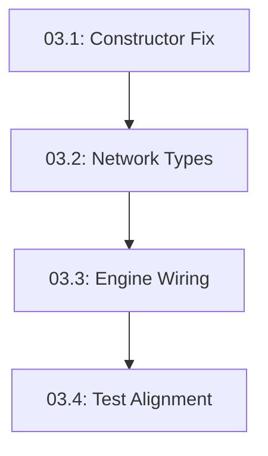

# Task Decomposition: Task 3 — Replace Engine Start Stub with Real Simplex Wiring

## Overview
This document decomposes the oversized Task 3 into 4 independently-testable sub-tasks. Each sub-task addresses a specific layer of the engine implementation, from infrastructure fixes to core wiring and final test alignment.

---

## Sub-task 03.1: Fix Engine Constructor and Test Infrastructure
**Complexity**: S
**Scope**: Fix the tokio runtime panic in `test_engine_can_be_constructed` by correcting how `commonware_tokio::Context` is managed in tests.
**Mapping to Original AC**: AC4 (`test_engine_can_be_constructed` passes)
**Dependency**: None
**TDD Ordering**: 1
**Mock Boundaries**: None (internal test helper fix)
**Files**:
- `crates/consensus-simplex/src/engine.rs` (test section)
**Description**:
The `test_context()` helper currently creates a runtime via `Runner::default().start()` which panics when dropped inside a `#[tokio::test]`. This must be fixed to use the existing tokio runtime or properly handle the lifecycle.
**Acceptance Criteria (Command-based)**:
- `nix develop --command cargo test --package consensus-simplex --lib engine::tests::test_engine_can_be_constructed` exits 0.

---

## Sub-task 03.2: Change Engine Network Generic to Per-Channel Provider
**Complexity**: S
**Scope**: Update `CommonwareEngine` to use `CommonwareNetworkProvider` (or a type compatible with `start_per_channel`) and update the constructor/test sites.
**Mapping to Original AC**: AC5 (`cargo build --workspace` exits 0)
**Dependency**: 03.1
**TDD Ordering**: 2
**Mock Boundaries**: Update `MockNetworkProvider` or its usage to support 3-channel registration.
**Files**:
- `crates/consensus-simplex/src/engine.rs` (struct definition, `impl` blocks)
- `crates/consensus-simplex/src/tests.rs` (mock network usage)
**Description**:
The engine currently bounds `N: p2p::NetworkProvider`, which only provides a single (Sender, Receiver) pair. Simplex requires 3 pairs (Vote, Certificate, Resolver). Change the engine's network handling to expect a provider that supports `start_per_channel()`.
**Acceptance Criteria (Command-based)**:
- `nix develop --command cargo build --package consensus-simplex` exits 0.

---

## Sub-task 03.3: Wire Real Simplex Engine in start()
**Complexity**: M
**Scope**: Replace the simulation thread stub with real `simplex::Engine` wiring using the components created in Tasks 1 and 2.
**Mapping to Original AC**: AC1, AC2, AC3 (functional pass of lifecycle tests)
**Dependency**: 03.2
**TDD Ordering**: 3
**Mock Boundaries**: Uses `MailboxActor`, `AppAdapter`, and `FinalizationSink` mocks/stubs from previous tasks.
**Files**:
- `crates/consensus-simplex/src/engine.rs` (`start()` method)
- `crates/consensus-simplex/src/config.rs` (if extensions for `simplex::Config` are needed)
**Description**:
1. Call `network.start_per_channel()`.
2. Construct `simplex::Config` from `CommonwareConfig`.
3. Initialize `simplex::Engine` with `AppAdapter` (Reporter), `Mailbox` (Automaton/Relay), and `RoundRobinElector`.
4. Start the engine and wrap the returned `Handle` in a `RunningEngine`.
5. Ensure `RunningEngine::status()` correctly reports height from the shared `AtomicU64`.
**Acceptance Criteria (Command-based)**:
- `nix develop --command cargo test --package consensus-simplex --lib engine::tests::test_engine_can_start_and_shutdown` exits 0.

---

## Sub-task 03.4: Align Test Names and Finalize Integration
**Complexity**: M
**Scope**: Rename existing tests to match Task 3's expected AC names and fix hanging tests in `tests.rs`.
**Mapping to Original AC**: AC1, AC2, AC3, AC6 (workspace test pass)
**Dependency**: 03.3
**TDD Ordering**: 4
**Mock Boundaries**: Requires real engine behavior to satisfy test assertions.
**Files**:
- `crates/consensus-simplex/src/tests.rs` (rename tests, fix timeouts)
- `crates/consensus-simplex/src/engine.rs` (align test names in internal module)
**Description**:
Rename `test_engine_start_and_status` to `test_engine_starts_with_real_simplex`, etc., to satisfy the original task's AC requirements. Adjust test deadlines and mock behaviors (e.g., in `tests.rs`) to work with the real asynchronous simplex engine instead of the 5s simulation thread.
**Acceptance Criteria (Command-based)**:
- `nix develop --command cargo test --workspace` exits 0.
- Verify specifically that `test_engine_starts_with_real_simplex`, `test_engine_shutdown_aborts_handle`, and `test_engine_status_tracks_height` all pass.

---

## Dependency Graph

